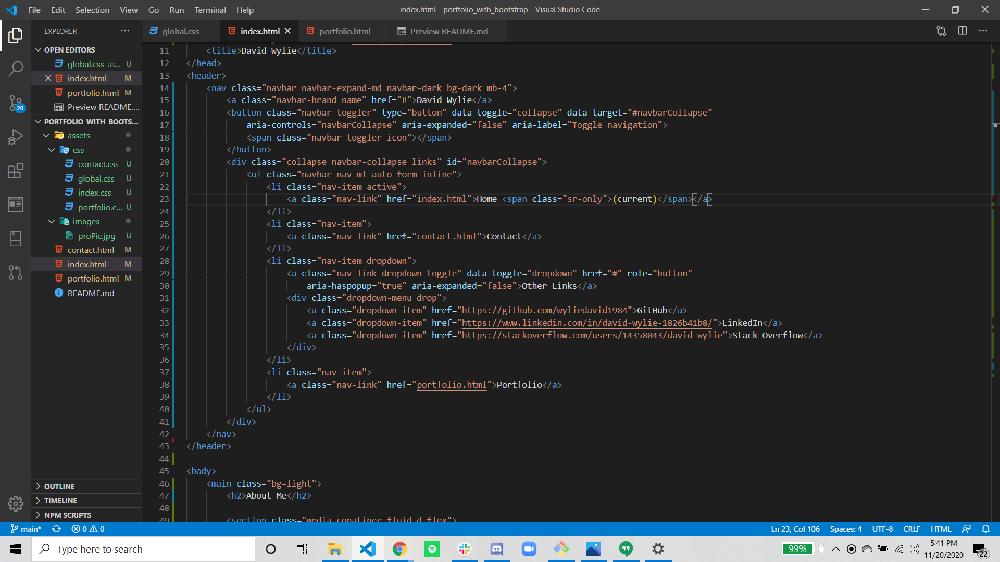
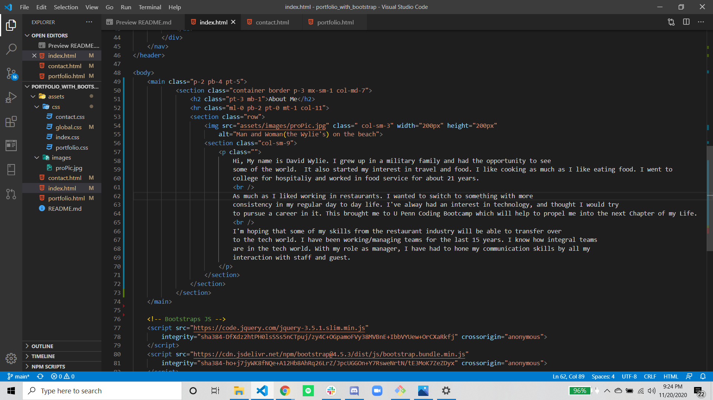
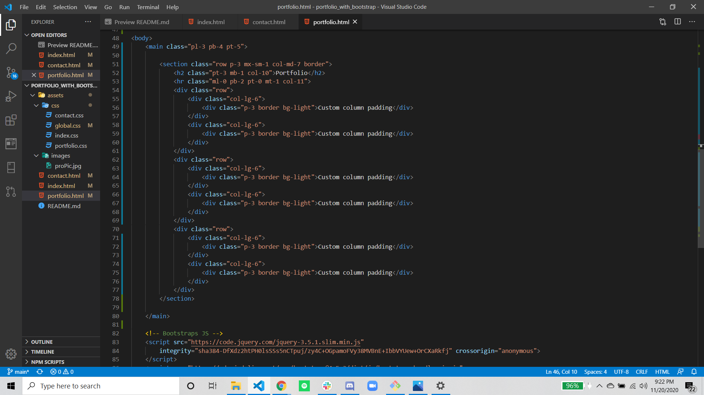

# portfolio_with_bootstrap

## Description
In this repository you will find three linked pages that mainly use bootstrap for the build and style. I did however did have to do a little extra styling and linked in a css sheet.  I did a lot of trial and errors testing out the classes of bootstrap. While also gaining a lot knowledge along the way with bootstrap and general layouts of grid systems.  The three pages are a home/index, portfolio, and a non-functioning contact.  They are some external links outside of the repository.  I have screenshot some of the progress along the way as well as finished products.  There are several screen shots of code and finished sites below. 

## screen shots

    
    

    
    
    
    

    
      

    
    
    
    
    
    
    

